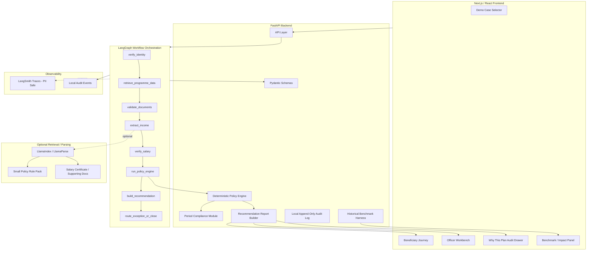
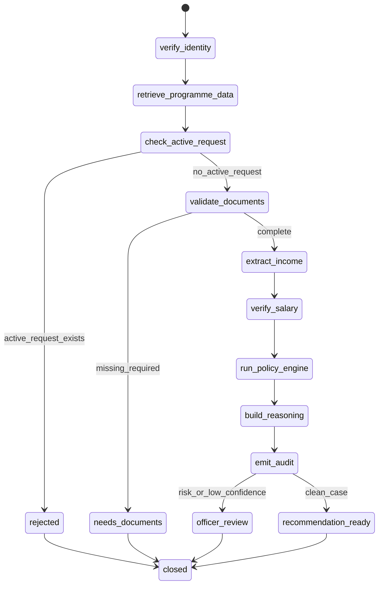
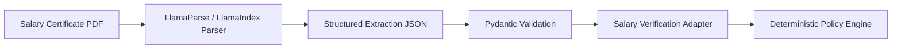
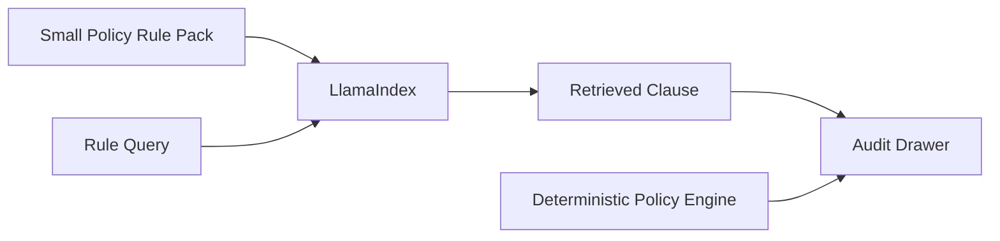
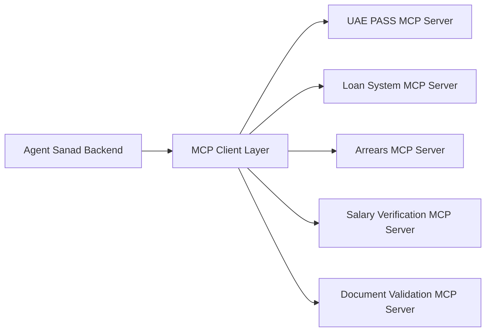

# Agent Sanad — PRD v1.1+ Tooling Addendum
### Industry-Standard Agent Framework Upgrade Plan
**Project:** AI Agent for Housing Loan Arrears Rescheduling  
**Programme:** Sheikh Zayed Housing Programme · UAE Ministry of Energy and Infrastructure (MOEI)  
**Hackathon:** Agentera — MOEI × 42 Abu Dhabi  
**Status:** Optional post-v0.8 upgrade PRD. Do not execute until Agent Sanad v0.8 is complete, tested, rehearsed, and demo-safe.

---

## 0. Purpose of this addendum

This document extends the original Agent Sanad v1.1 build bible with selective use of industry-standard AI-agent tooling.

The original v1.1 PRD correctly defined the core product: a governed casework agent for housing-loan arrears rescheduling with a deterministic policy engine, typed data contracts, mock MOEI integrations, an audit trail, benchmark validation, and officer-facing explainability.

However, v1.1 did not explicitly include modern agent frameworks such as LangGraph, LangSmith, LangChain, LlamaIndex, MCP, CrewAI, AutoGen, Semantic Kernel, DSPy, or the OpenAI Agents SDK.

This addendum answers one question:

> If Agent Sanad v0.8 is completed early, how do we upgrade toward v1.1 using industry-standard tooling without destabilizing the core product?

The answer is selective adoption:

- Use **LangGraph** for workflow/state orchestration.
- Use **LangSmith** for traceability, debugging, evaluation, and observability if PII-safe.
- Use **LlamaIndex or LlamaParse** only for document/policy retrieval if time allows.
- Use **LangChain** lightly only as a model/tool wrapper if it reduces implementation time.
- Treat **MCP** as a production roadmap layer, not a hackathon dependency.
- Do not implement CrewAI, AutoGen, Semantic Kernel, DSPy, or OpenAI Agents SDK before judging unless there is an exceptional reason.

The deterministic policy engine remains sacred.

---

## 1. Non-negotiable dependency: v0.8 must be finished first

This addendum must not be executed until the v0.8 MVP is already demo-proof.

### 1.1 Unlock condition

Only start this tooling upgrade if all of the following are true:

- The five v0.8 policy tests pass.
- The golden UPDATE case works end-to-end.
- The no-headroom TRANSFER case works end-to-end.
- The missing salary certificate case works.
- The active-request rejection case works.
- The contradiction/injection case works.
- The officer recommendation card shows all official Section-8 fields.
- The “Why this plan?” drawer correctly shows retrieved facts, fired rules, math, and recommendation.
- The benchmark/impact panel is visible.
- The demo runs with Wi-Fi off.
- A backup video has been recorded.
- The 3-minute demo has been rehearsed at least five times.
- No core demo path fails twice in rehearsal.

If any of these are false, do not touch LangGraph, LangSmith, LlamaIndex, or any other framework.

### 1.2 Upgrade philosophy

The tooling upgrade must obey this rule:

> Frameworks may orchestrate, trace, retrieve, parse, and observe. They must never decide the money.

The following must remain controlled by our own deterministic Python code:

- 20% deduction cap
- headroom calculation
- UPDATE_INSTALLMENT vs TRANSFER_ARREARS path
- period compliance
- active-request rejection
- risk-based referral
- final recommendation category
- rule IDs
- compliance chips
- benchmark replay logic

---

## 2. Tooling decisions

### 2.1 Summary table

| Tool | Use in v1.1+? | Role in Agent Sanad | Hackathon priority |
|---|---:|---|---|
| LangGraph | Yes | State/workflow orchestration | High, after v0.8 |
| LangSmith | Yes, if PII-safe | Tracing, observability, prompt/debug evaluation | Medium-high |
| LangChain | Maybe, lightly | Model/tool wrapper only | Low-medium |
| LlamaIndex / LlamaParse | Optional | Salary certificate parsing or policy/rule retrieval | Medium |
| MCP | Roadmap only | Future typed adapter layer for MOEI systems | Low for hackathon |
| CrewAI | No | Multi-agent crews, not needed | Do not implement |
| AutoGen | No | Conversational/multi-agent workflows, overkill | Do not implement |
| Semantic Kernel | No | Enterprise SDK, mainly useful in Microsoft stack | Do not implement |
| DSPy | No for hackathon | Prompt/program optimization later | Do not implement |
| OpenAI Agents SDK | No for this sprint | Alternative agent framework, not needed with Claude/FastAPI | Do not implement |

---

## 3. Updated v1.1+ architecture

### 3.1 Core architecture



### 3.2 Responsibility split

| Layer | Responsibility | Must never do |
|---|---|---|
| FastAPI | API surface, request handling, response packaging | Decide financial plan directly outside engine |
| Pydantic | Validate all data contracts | Accept unknown fields or untyped objects |
| LangGraph | Orchestrate workflow states and transitions | Compute installment or approve/reject |
| LangSmith | Trace and evaluate runs | Store raw PII |
| LlamaIndex/LlamaParse | Parse/retrieve document or policy context | Infer policy or decide repayment plan |
| LangChain | Optional model/tool wrapper | Become the central agent loop |
| Deterministic policy engine | Make all financial and policy decisions | Call LLM to decide money |
| Human officer | Approve, adjust, escalate exceptions | Bypass audit log |

---

## 4. LangGraph integration PRD

### 4.1 Why LangGraph

LangGraph is the strongest framework fit for full Agent Sanad v1.1 because Agent Sanad already has a hard workflow:

```text
Submitted
→ IdentityLinked
→ DataRetrieved
→ Extracting
→ Validating
→ PolicyRun
→ RecommendationReady
→ OfficerReview
→ Approved / Adjusted / Refer / Rejected
→ Closed
```

In v0.8, this can be implemented as one orchestrator function. In v1.1+, LangGraph becomes useful because it gives us:

- explicit nodes and edges,
- stateful workflow execution,
- conditional branching,
- human-in-the-loop routing,
- persistence/resumability in production,
- better visualization of the agentic workflow,
- easier integration with LangSmith tracing.

### 4.2 LangGraph scope

LangGraph should replace only the orchestration wrapper, not the policy engine.

Current v0.8 style:

```python
def run_demo_case(case_id):
    applicant = uae_pass(...)
    loan = loan_adapter(...)
    arrears = arrears_adapter(...)
    docs = validate_docs(...)
    income = verify_salary(...)
    report = decide(case, policy)
    audit = build_audit(...)
    return {"case": case, "report": report, "audit": audit}
```

v1.1+ LangGraph style:

```python
graph.invoke({
    "case_id": case_id,
    "mock_mode": True,
    "policy_version": "sanad-v1.1+tooling"
})
```

The graph executes the same steps, but as explicit nodes.

### 4.3 LangGraph state object

```python
from typing import TypedDict, Optional

class SanadGraphState(TypedDict, total=False):
    case_id: str
    case_state: str

    applicant: dict
    loan: dict
    arrears: dict
    documents: dict
    income: dict
    hardship: dict

    report: dict
    audit_events: list[dict]
    risk_flags: list[str]
    fired_rules: list[str]

    benchmark_metrics: dict
    error: Optional[str]
    mock_mode: bool
```

### 4.4 Required LangGraph nodes

| Node | Input | Output | Implementation |
|---|---|---|---|
| `verify_identity` | `case_id` | `applicant` | Calls UAE PASS mock adapter |
| `retrieve_programme_data` | `applicant/agreement_id` | `loan`, `arrears` | Calls loan + arrears adapters |
| `check_active_request` | `arrears` | route to reject or continue | Deterministic guard |
| `validate_documents` | `documents` | complete/incomplete | Document validation adapter |
| `extract_income` | salary certificate text/cached trace | raw income fields | Cached extraction or LLM/LlamaParse |
| `verify_salary` | extracted income | verified income | Salary verification adapter |
| `run_policy_engine` | validated case | `RecommendationReport` | Calls `decide()` only |
| `build_reasoning` | report + fired rules | reasoning text | LLM optional, cached fallback |
| `emit_audit` | state delta | audit events | Local audit + optional LangSmith |
| `route_exception_or_close` | recommendation/risk | final state | Deterministic routing |

### 4.5 LangGraph edges



### 4.6 Acceptance criteria for LangGraph integration

- Existing v0.8 tests still pass.
- `decide()` output remains byte-identical before and after LangGraph wrapping.
- Golden case still works offline.
- Five demo cases still work.
- Graph node names are visible in audit output.
- Graph failure falls back to the existing v0.8 `/demo/run` path.
- LangGraph does not call the LLM for policy decisions.

### 4.7 Implementation order

1. Keep current v0.8 `/demo/run/{case_id}` working.
2. Add `backend/graph/state.py`.
3. Add `backend/graph/nodes.py`.
4. Add `backend/graph/build_graph.py`.
5. Create `POST /demo/run-graph/{case_id}`.
6. Compare `/demo/run` and `/demo/run-graph` outputs.
7. If outputs match, switch frontend to `run-graph`.
8. Keep `/demo/run` as fallback.

---

## 5. LangSmith integration PRD

### 5.1 Why LangSmith

LangSmith can strengthen the technical story by showing professional observability:

- trace each workflow run,
- inspect LLM reasoning calls,
- inspect tool/adapter calls,
- compare outputs across test cases,
- debug failed runs,
- support evaluation and regression testing.

However, it must not compromise PII safety or offline reliability.

### 5.2 LangSmith scope

Use LangSmith only for:

- synthetic demo cases,
- masked identifiers,
- reasoning-generation traces,
- extraction traces if using LLM extraction,
- graph node traces,
- evaluation over the five demo cases.

Do not send:

- raw Emirates-ID-style identifiers,
- raw Arabic hardship narratives,
- real workbook rows,
- unmasked applicant names,
- raw salary certificates containing sensitive data.

### 5.3 PII redaction requirements

Before any LangSmith trace:

```python
def redact_for_trace(payload: dict) -> dict:
    # Remove or mask names, national IDs, agreement IDs, raw narratives,
    # raw document text, and filenames that contain identifiers.
    return redacted_payload
```

Rules:

- `name_masked` only.
- `applicant_ref` synthetic only.
- `agreement_id` synthetic only.
- salary and arrears values may be retained in synthetic cases.
- raw document text is excluded unless synthetic.
- benchmark data is aggregated only.

### 5.4 LangSmith acceptance criteria

- Traces are optional and can be disabled with `LANGSMITH_TRACING=false`.
- Offline demo works with LangSmith disabled.
- No raw PII appears in trace payloads.
- The five demo cases can be run as an evaluation set.
- Trace view shows at least case id, graph nodes, adapter calls, policy engine step, reasoning generation step, and final recommendation.

### 5.5 Environment flags

```env
LANGSMITH_TRACING=false
LANGSMITH_PROJECT=agent-sanad-demo
LANGSMITH_ENDPOINT=https://api.smith.langchain.com
LANGSMITH_API_KEY=
TRACE_REDACTION=true
```

### 5.6 Pitch line

> For the MVP, we keep a local audit log visible to officers. For production-grade observability, the same workflow can emit LangSmith traces so MOEI engineers can inspect state transitions, tool calls, model outputs, and evaluation results without exposing raw beneficiary data.

---

## 6. LlamaIndex / LlamaParse integration PRD

### 6.1 Why optional

LlamaIndex or LlamaParse is useful only if Agent Sanad expands beyond cached salary values into real document parsing or policy-document retrieval.

It should not be used for the deterministic decision engine.

### 6.2 Approved use cases

| Use case | Priority | Description |
|---|---:|---|
| Golden-case salary certificate parsing | Medium | Parse one salary certificate into structured income fields |
| Supporting-document parsing | Low | Extract hardship indicators from medical/assignment docs |
| Policy/rule retrieval | Medium-low | Retrieve relevant brief/rule clauses for audit drawer |
| Historical workbook Q&A | No | Do not build a chat interface over the workbook |
| Large MOEI policy corpus | Future | Useful if MOEI provides manuals/circulars |

### 6.3 Document parsing flow



### 6.4 Policy retrieval flow



### 6.5 Guardrails

- Retrieved policy text is explanatory, not authoritative execution logic.
- The policy engine uses `config.yaml` and `rules.py`, not LlamaIndex output.
- If retrieval fails, decision output is unchanged.
- The UI may show retrieved policy clauses in the audit drawer, but not use them to compute.

### 6.6 Acceptance criteria

- Existing v0.8 results unchanged.
- Golden salary certificate can be parsed into schema.
- Cached fallback exists.
- Pydantic rejects malformed parse output.
- Policy retrieval is optional and failure-safe.
- No decision depends on retrieved text.

---

## 7. LangChain integration PRD

### 7.1 Use only lightly

LangChain is not the centre of Agent Sanad. LangGraph is the proper orchestration layer. LangChain may be useful only if it reduces boilerplate for:

- model initialization,
- structured output,
- prompt templates,
- tool wrappers,
- simple reasoning-generation calls.

### 7.2 Approved use

```python
# acceptable
reasoning_chain = prompt | model.with_structured_output(ReasoningSchema)
```

### 7.3 Forbidden use

```python
# forbidden
agent = create_agent(...)
agent decides approve/reject/payment/path
```

LangChain must never own the financial decision.

### 7.4 Acceptance criteria

- LangChain call is isolated in `reasoning.py` or `extraction.py`.
- Cached fallback exists.
- If LangChain fails, report still renders.
- The deterministic report fields do not change.

---

## 8. MCP production roadmap

### 8.1 Why MCP is future, not hackathon core

MCP is useful as a future standard for exposing tools and data systems to AI applications. In production, MOEI system adapters could eventually be exposed as secure MCP servers:

- UAE PASS profile server
- loan-system server
- arrears-ledger server
- salary-verification server
- document-validation server
- audit-log server

But this is not necessary for the hackathon.

### 8.2 Roadmap architecture



### 8.3 Hackathon pitch line

> For the hackathon, we implemented direct typed Python adapters for safety and speed. In production, the same adapter boundaries could be exposed as MCP-compatible servers after security review.

### 8.4 Acceptance criteria for future MCP

- OAuth/service authentication in place.
- Per-tool permissions defined.
- No LLM direct write access.
- Tool outputs schema-validated.
- Audit log records every tool call.
- Security review completed.

---

## 9. Tools explicitly not selected

### 9.1 CrewAI

CrewAI is designed for multi-agent crews and collaborative task execution. Agent Sanad does not need a team of agents. It needs one controlled casework workflow.

Decision: do not implement.

### 9.2 Microsoft AutoGen

AutoGen is useful for conversational and multi-agent workflows. Agent Sanad is not a conversation between agents.

Decision: do not implement.

### 9.3 Semantic Kernel

Semantic Kernel is strong in Microsoft/Azure enterprise environments, but the current stack is Python/FastAPI/Claude. It would add unnecessary abstraction.

Decision: do not implement.

### 9.4 DSPy

DSPy may be valuable later for optimizing extraction/reasoning prompts using metrics. It is not useful enough for the hackathon window.

Decision: do not implement.

### 9.5 OpenAI Agents SDK

OpenAI Agents SDK is a serious alternative agent framework, but the project is being executed mainly with Claude/Anthropic tooling and custom deterministic code. Adding a second agent SDK is unnecessary.

Decision: do not implement.

---

## 10. Updated repository structure

```text
agent-sanad/
├── docs/
│   ├── Agent_Sanad_PRD_v0.8_MVP.md
│   ├── Agent_Sanad_PRD_v1.1.md
│   └── Agent_Sanad_PRD_v1.1_Tooling_Addendum.md
├── backend/
│   ├── app.py
│   ├── schemas.py
│   ├── orchestrator.py                 # existing fallback orchestrator
│   ├── graph/
│   │   ├── state.py                    # LangGraph state object
│   │   ├── nodes.py                    # verify/retrieve/validate/extract/decide nodes
│   │   ├── build_graph.py              # graph construction
│   │   └── compare_outputs.py          # old vs graph route comparison
│   ├── policy/
│   │   ├── engine.py
│   │   ├── period.py
│   │   ├── rules.py
│   │   └── config.yaml
│   ├── adapters/
│   │   ├── uae_pass.py
│   │   ├── loan.py
│   │   ├── arrears.py
│   │   ├── salary_verify.py
│   │   ├── doc_validate.py
│   │   └── fixtures/
│   ├── extraction/
│   │   ├── pipeline.py
│   │   ├── prompts.py
│   │   └── llamaindex_parser.py        # optional
│   ├── observability/
│   │   ├── redaction.py
│   │   ├── langsmith_trace.py
│   │   └── local_audit.py
│   ├── audit.py
│   ├── report.py
│   ├── confidence.py
│   └── reasoning.py
├── benchmark/
│   ├── normalize.py
│   ├── replay.py
│   ├── score.py
│   └── data/                           # gitignored
├── frontend/
├── seeds/
│   ├── cases_v1.json
│   └── cached_traces/
└── tests/
    ├── test_policy.py
    ├── test_graph_equivalence.py
    ├── test_redaction.py
    ├── test_langsmith_optional.py
    └── test_extraction_optional.py
```

---

## 11. New tests required by this addendum

### 11.1 Graph equivalence test

```python
def test_graph_and_plain_orchestrator_match_golden():
    plain = run_demo_case("GOLDEN")
    graph = run_graph_case("GOLDEN")
    assert plain["report"] == graph["report"]
```

Repeat for all five demo cases.

### 11.2 LangSmith redaction test

```python
def test_trace_redaction_removes_pii():
    payload = build_trace_payload(case)
    redacted = redact_for_trace(payload)
    assert "emirates_id" not in str(redacted).lower()
    assert "raw_narrative" not in redacted
```

### 11.3 Optional retrieval failure test

```python
def test_llamaindex_failure_does_not_change_decision():
    baseline = run_demo_case("GOLDEN")
    with force_retrieval_failure():
        result = run_demo_case("GOLDEN")
    assert result["report"]["proposed_plan"] == baseline["report"]["proposed_plan"]
```

### 11.4 LangGraph fallback test

```python
def test_graph_failure_falls_back_to_plain_orchestrator():
    with force_graph_failure():
        result = run_demo_case("GOLDEN")
    assert result["report"]["recommendation"] == "Approve"
    assert result["fallback_used"] is True
```

---

## 12. Implementation sequence after v0.8

### Phase T1: LangGraph wrapper

Timebox: 2–3 hours.

Deliverables:

- `backend/graph/state.py`
- `backend/graph/nodes.py`
- `backend/graph/build_graph.py`
- `POST /demo/run-graph/{case_id}`
- graph equivalence tests

Go/no-go:

- If equivalence tests fail after 90 minutes, revert and keep v0.8 route.

### Phase T2: LangSmith optional tracing

Timebox: 60–90 minutes.

Deliverables:

- `observability/redaction.py`
- `observability/langsmith_trace.py`
- `LANGSMITH_TRACING=false` by default
- redaction tests

Go/no-go:

- If PII redaction is not obviously safe, do not enable LangSmith.

### Phase T3: LlamaIndex/LlamaParse optional parsing

Timebox: 90 minutes.

Deliverables:

- golden-case salary parsing only
- Pydantic validation
- cached fallback
- extraction failure test

Go/no-go:

- If parsing is flaky, disable live parsing and keep cached values.

### Phase T4: UI/pitch polish

Deliverables:

- architecture slide updated with LangGraph/LangSmith optional layer
- audit drawer shows graph node names if graph mode enabled
- demo script includes one sentence about production migration

---

## 13. Demo framing after tooling upgrade

### 13.1 Main pitch line

> Agent Sanad is not a chatbot. It is a governed casework agent. LangGraph orchestrates the workflow, Pydantic contracts validate every object, deterministic Python enforces the 20% and period rules, LangSmith can trace runs for observability, and the officer sees an evidence-linked audit drawer before approving exceptions.

### 13.2 Short technical explanation

> We separated the architecture into four layers: orchestration, data contracts, deterministic policy, and observability. LangGraph handles the case journey. The policy engine remains independent and deterministic. LangSmith is optional tracing. LlamaIndex is optional document parsing. This gives us professional agent infrastructure without allowing an LLM to make financial decisions.

### 13.3 If asked why not use CrewAI/AutoGen

> Those are stronger for multi-agent collaboration. This service does not need a society of agents; it needs a controlled government casework pipeline. We deliberately chose LangGraph because it maps to our state machine and human-in-the-loop requirements.

### 13.4 If asked whether the framework decides

> No. The framework only routes the case through states. The decision is made by our deterministic policy engine, which is tested and benchmarked against historical decisions.

---

## 14. Risk register

| Risk | Impact | Mitigation |
|---|---|---|
| Framework integration breaks working demo | High | Keep old `/demo/run` route as fallback |
| LangGraph changes output shape | High | Graph equivalence tests |
| LangSmith leaks PII | High | Redaction required, tracing off by default |
| LlamaIndex parsing is flaky | Medium | Cached fallback, optional only |
| Team spends time on tools instead of demo | High | Unlock condition required before addendum |
| Judge sees tooling as buzzword dumping | Medium | Explain functionally: orchestration, tracing, parsing |
| Tooling makes app slower | Medium | Cached/offline mode remains default |
| Money path accidentally altered | Critical | `decide()` untouched, tests rerun |

---

## 15. Definition of done for v1.1+ tooling addendum

This addendum is complete only if:

- v0.8 still works unchanged.
- Five policy tests still pass.
- Five graph equivalence tests pass.
- The frontend can run using either plain route or graph route.
- Offline mode still works.
- The benchmark panel still shows the 94.6% result.
- LangSmith tracing is either safely redacted or disabled.
- Any LlamaIndex/LlamaParse parsing has cached fallback.
- The demo script remains under 3 minutes.
- No feature has failed twice in rehearsal.

---

## 16. Final instruction to Claude Code

Use this only after v0.8 passes the go/no-go checklist:

```text
Read docs/Agent_Sanad_PRD_v1.1_Tooling_Addendum.md.

Do not modify the deterministic policy engine, policy/config.yaml, period.py, or tests/test_policy.py.

Implement Phase T1 only:
- backend/graph/state.py
- backend/graph/nodes.py
- backend/graph/build_graph.py
- POST /demo/run-graph/{case_id}
- tests/test_graph_equivalence.py

The LangGraph route must call the existing adapters and existing decide() function.
The report output must be identical to the existing /demo/run route for all five demo cases.
Keep /demo/run as fallback.
Stop after graph equivalence tests pass.
```

---

## 17. Final note

This tooling addendum exists to make Agent Sanad look more industry-grade only after the core MVP is already winning.

Do not use these frameworks to impress yourself. Use them only if they make the product more explainable, more traceable, more robust, or more production-shaped.

The final architecture principle remains:

> LangGraph orchestrates. LangSmith observes. LlamaIndex retrieves or parses. Pydantic validates. The deterministic policy engine decides. The human officer handles exceptions.
