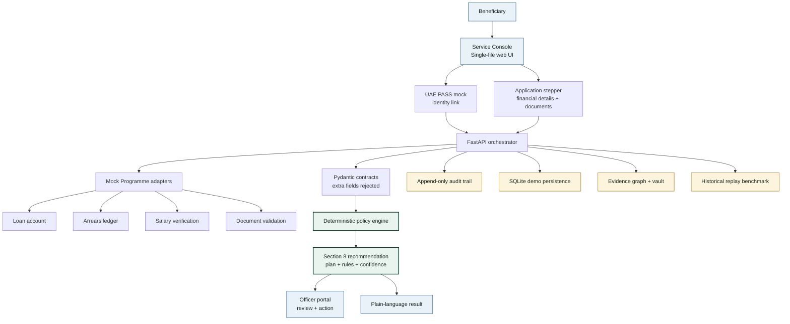
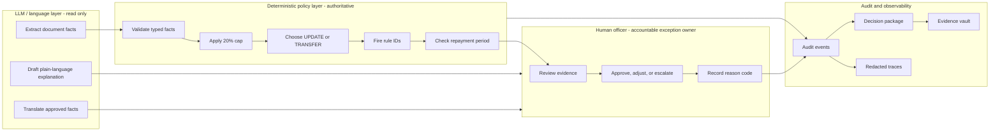
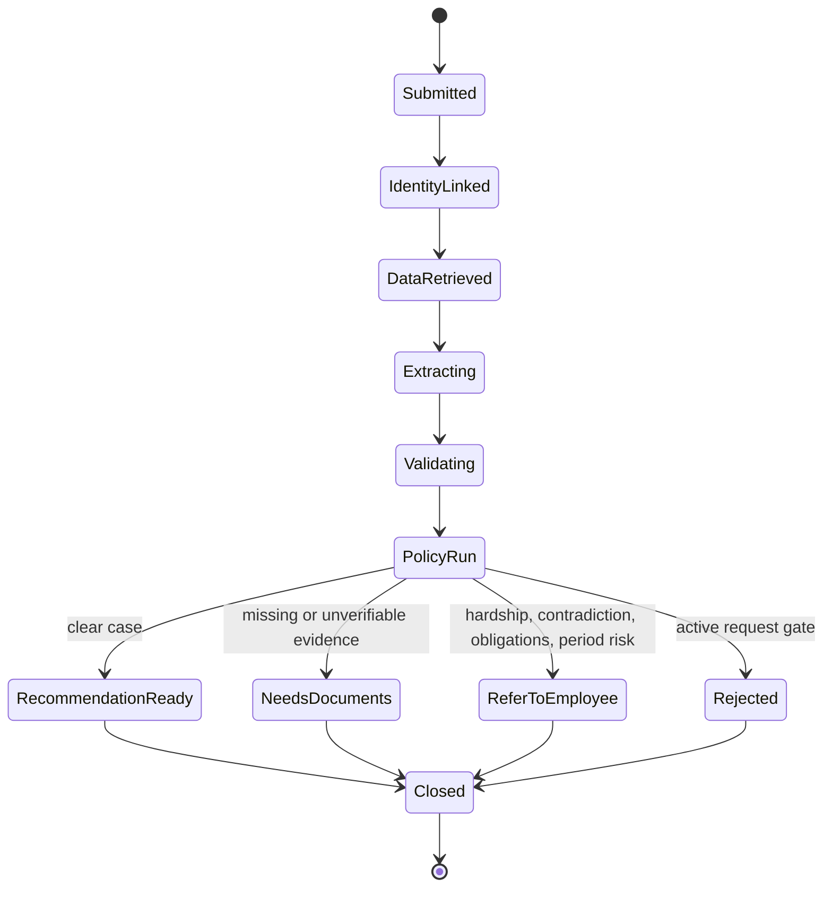
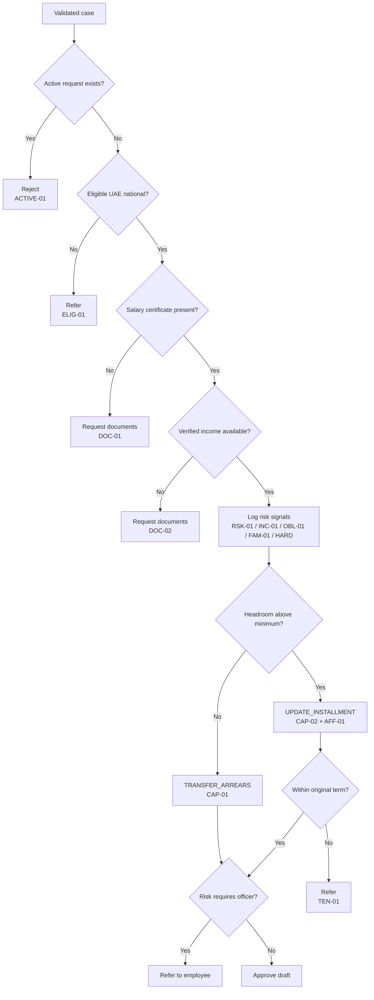

<!-- ════════════════════════════════════════════════════════════════════════ -->
<!--                              A G E N T   S A N A D                         -->
<!-- ════════════════════════════════════════════════════════════════════════ -->

<div align="center">

```
 █████╗  ██████╗ ███████╗███╗   ██╗████████╗   ███████╗ █████╗ ███╗   ██╗ █████╗ ██████╗
██╔══██╗██╔════╝ ██╔════╝████╗  ██║╚══██╔══╝   ██╔════╝██╔══██╗████╗  ██║██╔══██╗██╔══██╗
███████║██║  ███╗█████╗  ██╔██╗ ██║   ██║      ███████╗███████║██╔██╗ ██║███████║██║  ██║
██╔══██║██║   ██║██╔══╝  ██║╚██╗██║   ██║      ╚════██║██╔══██║██║╚██╗██║██╔══██║██║  ██║
██║  ██║╚██████╔╝███████╗██║ ╚████║   ██║      ███████║██║  ██║██║ ╚████║██║  ██║██████╔╝
╚═╝  ╚═╝ ╚═════╝ ╚══════╝╚═╝  ╚═══╝   ╚═╝      ╚══════╝╚═╝  ╚═╝╚═╝  ╚═══╝╚═╝  ╚═╝╚═════╝
```

### A governed, agentic casework system for housing-loan arrears rescheduling

**Sheikh Zayed Housing Programme** · UAE Ministry of Energy &amp; Infrastructure
*Agentera Hackathon · MOEI × 42 Abu Dhabi*

<br/>

[](#testing-and-release-confidence)
[](https://www.python.org/)
[](https://fastapi.tiangolo.com/)
[](https://docs.pydantic.dev/)
[](#responsibility-boundary)
[](#quick-start)
[](#benchmark-and-proof)
[](#decision-engine)
[](#responsibility-boundary)
[](#production-boundary)
[](https://agent-sanad-lovat.vercel.app/)
[](#production-boundary)

<br/>

> **`LLM reads and explains.`**&nbsp;&nbsp;**`Deterministic code decides.`**&nbsp;&nbsp;**`A human officer owns exceptions.`**

*Turns a five-working-day manual review into a sub-second, evidence-linked, fully-audited decision draft — without ever letting a language model touch the money.*

</div>

---

## Ten-Second Pitch

Housing-loan arrears rescheduling is a high-stakes government workflow: a family is behind on payments, an officer must inspect income and arrears, and the Ministry must protect both the beneficiary and the public policy rulebook.

Agent Sanad turns that manual review into an instant, evidence-linked decision draft. It retrieves mocked Programme data, validates uploaded evidence, applies MOEI rescheduling rules, and produces an officer-ready recommendation with fired rules, calculations, confidence, audit events, and escalation paths.

The engineering moat is the boundary: **the LLM reads and explains; deterministic Python decides; a human officer owns exceptions.** Agent Sanad is not a chatbot, not autonomous underwriting, and not generic RAG. It is a governed casework system built around policy compliance, traceability, and human accountability.

**Live demo:** [agent-sanad-lovat.vercel.app](https://agent-sanad-lovat.vercel.app/)<br/>
**Current release:** v1.8.0, 431 tests passing, 190 mounted API routes, 45 release gates, offline mock mode by default.

---

## Contents

- [Why This Is Not A Chatbot](#why-this-is-not-a-chatbot)
- [Architecture Overview](#architecture-overview)
- [Responsibility Boundary](#responsibility-boundary)
- [End-To-End Workflow](#end-to-end-workflow)
- [Official Rule Enforcement](#official-rule-enforcement)
- [Decision Engine](#decision-engine)
- [Demo Case Suite](#demo-case-suite)
- [UI Surfaces](#ui-surfaces)
- [Benchmark And Proof](#benchmark-and-proof)
- [Testing And Release Confidence](#testing-and-release-confidence)
- [API Surface](#api-surface)
- [Security, Safety, And Governance](#security-safety-and-governance)
- [Integration Model](#integration-model)
- [Production Boundary](#production-boundary)
- [Quick Start](#quick-start)
- [Five-Minute Judge Demo](#five-minute-judge-demo)
- [Repository Map](#repository-map)
- [Why This Wins](#why-this-wins)
- [Documentation Index](#documentation-index)

---

## Why This Is Not A Chatbot

Agent Sanad is deliberately narrower, stricter, and more auditable than a conversational assistant. Its purpose is not to answer questions about policy; its purpose is to assemble a case, apply the policy, draft a recommendation, and prove how it got there.

| Capability | Chatbot | Generic RAG Assistant | Black-Box AI Recommender | Agent Sanad |
|---|---:|---:|---:|---:|
| Owns financial decision | Often implied | No | Often yes | **No LLM ownership; deterministic engine decides** |
| Enforces 20% cap | Prompt-dependent | Retrieval-dependent | Model-dependent | **Code-enforced in `backend/policy/engine.py`** |
| Uses typed contracts | Optional | Optional | Usually hidden | **Pydantic schemas and adapter contracts** |
| Evidence trace | Conversation transcript | Source snippets | Usually opaque | **Adapter events, fired rules, audit chain, evidence graph** |
| Human escalation | Manual handoff | Manual handoff | Often unclear | **Officer-owned approve / adjust / escalate path** |
| Prompt injection impact | Can influence answer | Can influence answer | Can influence score | **Logged as RSK-01; cannot change policy logic** |
| Production suitability | Support surface | Search surface | Risky for finance | **Production-shaped prototype with pilot-ready architecture** |

> The most important design decision in this repository is that the language model is not trusted with money. It can explain approved facts, but it cannot compute installments, choose the rescheduling path, approve, reject, or write state.

---

## Architecture Overview

Agent Sanad is a single FastAPI service with a vanilla single-file UI, deterministic policy core, SQLite persistence, mocked national-service adapters, and optional orchestration/observability wrappers. The demo path is offline-first and repeatable.



| Layer | Main files | Purpose |
|---|---|---|
| User experience | `frontend/index.html`, `frontend/i18n.json` | Beneficiary service, officer portal, Arabic/English support, demo workspaces |
| API and orchestration | `backend/app.py`, `backend/routes_v1_5.py`, `backend/routes_v1_8.py` | 190 mounted API routes, error envelope, state flow, demo endpoints |
| Decision core | `backend/policy/engine.py`, `backend/policy/period.py`, `backend/policy/config.yaml`, `backend/policy/rules.py` | Protected deterministic money path |
| Data contracts | `backend/schemas.py`, `backend/api_models.py` | Pydantic v2 request/response contracts |
| Integrations | `backend/adapters/`, `backend/connectors.py` | Fixture-backed and connector-shaped mock integrations |
| Assurance | `backend/audit_chain.py`, `backend/evidence_graph_v2.py`, `backend/evidence_vault.py`, `backend/observability/` | Audit, provenance, redaction, traceability |
| Pilot story layer | `backend/rescue_radar.py`, `backend/policy_digital_twin.py`, `backend/mission_control.py`, `backend/redteam_lab.py` | Deterministic v1.8 simulation surfaces for judges and pilot reviewers |

---

## Responsibility Boundary

The repository is designed so that every actor has a sharply limited role. This is what makes the system credible for a ministry-grade financial workflow.



| Boundary | Allowed | Explicitly forbidden |
|---|---|---|
| LLM / language layer | Read evidence, summarize facts, explain a completed recommendation, translate text | Compute installments, choose path, approve, reject, mutate state, override rule IDs |
| Deterministic policy layer | Validate schemas, compute headroom, enforce cap, choose path, fire rules, produce recommendation | Invent facts, rely on prompt text, bypass configured policy |
| Human officer layer | Approve, adjust, escalate, request evidence, own exceptions | Bypass audit, silently alter policy result |
| Audit and observability | Record provenance, redact traces, expose receipts, support review | Leak PII, replace the policy engine, become a hidden decision layer |

---

## End-To-End Workflow

The core case journey follows a canonical state machine. The UI reconstructs the timeline from real audit events rather than decorative progress bars.



| Stage | What happens | Judge-visible proof |
|---|---|---|
| Submitted | Application is created from sample data or a custom form | Application id, audit event |
| IdentityLinked | UAE PASS mock links a synthetic beneficiary identity | Mock identity card and adapter event |
| DataRetrieved | Loan, arrears, family, and history facts are retrieved | Adapter source map |
| Extracting | Salary-certificate income is parsed or loaded from cached fixture | Extraction source in audit |
| Validating | Documents and income are checked against typed contracts | DOC-01 / DOC-02 outcomes if incomplete |
| PolicyRun | Deterministic `decide()` executes policy gates and calculations | Fired rules, cap/period chips, calculation trace |
| RecommendationReady | Clear cases receive a draft recommendation | Section 8 report and plan |
| NeedsDocuments | Incomplete cases request evidence instead of deciding | Required actions panel |
| ReferToEmployee | Risky cases route to a human officer | Referral reason, confidence, rule IDs |
| Rejected | Active duplicate request is blocked | ACTIVE-01 hard-stop result |
| Closed | The case journey is finalized in the audit timeline | Closed state event |

---

## Official Rule Enforcement

The system encodes the official rescheduling constraints as deterministic guardrails, not as prompt instructions.

| Rule / control | Where enforced | Example case | Outcome | Why it matters |
|---|---|---|---|---|
| 20% deduction cap | `backend/policy/engine.py`, `backend/policy/config.yaml` | `GOLDEN`, `HIGH_CAPACITY_UPDATE` | UPDATE plan stays at or below 20% of verified income | Protects affordability and prevents model drift |
| Repayment period constraint | `backend/policy/period.py` | `PERIOD_BREACH` | Refer with `TEN-01`; period compliance fails | Prevents schedules beyond the original approved term |
| Active request blocking | `backend/policy/engine.py` | `ACTIVE` | Reject with `ACTIVE-01` before computation | Avoids duplicate active rescheduling requests |
| Document completeness | `backend/policy/engine.py`, `backend/adapters/` | `MISSING`, `ZERO_OR_MISSING_INCOME` | Request documents with `DOC-01` or `DOC-02` | Stops decisions when evidence is missing or unverifiable |
| Income contradiction | `backend/policy/engine.py` | `CONTRA` | Refer with `INC-01` | Keeps contradictory evidence under human review |
| High obligations | `backend/policy/engine.py` | `HIGH_OBLIGATIONS` | Refer with `OBL-01`; compliant plan may still be drafted | Flags repayment stress even when a plan can be computed |
| Hardship handling | `backend/policy/engine.py` | `HARDSHIP`, `UNVERIFIED_HARDSHIP`, `NOHEAD` | Transfer arrears or refer depending on evidence | Keeps social hardship visible and auditable |
| Prompt injection handling | `backend/policy/engine.py`, `backend/reasoning.py` | `PROMPT_INJECTION_ONLY`, `CONTRA` | Log `RSK-01`; policy result unchanged | Treats uploaded text as untrusted content |
| Human exception ownership | `backend/schemas.py`, `POST /cases/{id}/officer-action` | Referred cases | Officer action requires structured reason for adjust/escalate | Makes discretion explicit and reviewable |

---

## Decision Engine

`backend/policy/engine.py` is the protected money path. It accepts a validated `Case`, applies hard gates, computes affordability, selects the rescheduling path, checks risk signals, and returns the official Section 8-style `RecommendationReport`.

```text
input: validated Case

if active_request_exists:
    reject with ACTIVE-01

if applicant is not eligible:
    refer with ELIG-01

if salary certificate is missing:
    request documents with DOC-01

if verified income is missing or zero:
    request documents with DOC-02

risk_flags = prompt injection, contradiction, obligations, hardship, family pressure
salary = verified_monthly_income
cap = salary * deduction_cap_pct
headroom = cap - current_installment

if headroom <= configured minimum:
    plan = TRANSFER_ARREARS
else:
    plan = UPDATE_INSTALLMENT
    premium = floor(headroom)
    months = ceil(arrears / premium)
    new_total_installment = current_installment + premium

if plan violates original repayment period:
    refer with TEN-01

if contradiction, high obligations, or unverified hardship:
    refer to employee with fired rules
else:
    approve clear cases, or keep low-risk social flags as confidence signals

return report + proposed plan + compliance chips + fired rules + reasoning + audit
```



The formulas are intentionally simple and reviewable: salary cap, headroom, floor/ceil rounding, repayment-period check, and rule IDs are visible in tests and in the officer portal. This is system design, not prompt engineering.

---

## Demo Case Suite

The 13 seeded cases are synthetic and fixture-backed. Together they exercise the policy gates, risk matrix, evidence paths, and exception handling story.

| Case | Judge-friendly name | What it proves | Expected result | Key rule IDs |
|---|---|---|---|---|
| `GOLDEN` | Clean update | Clear affordability path under the 20% cap | Approve, UPDATE_INSTALLMENT | `CAP-02`, `AFF-01` |
| `NOHEAD` | No headroom | Beneficiary cannot absorb a higher installment | Refer, TRANSFER_ARREARS | `HARD-01`, `CAP-01`, `FAM-01` |
| `MISSING` | Missing salary certificate | Evidence must exist before a decision | Request documents | `DOC-01` |
| `ACTIVE` | Active request | Duplicate active request is a hard stop | Reject | `ACTIVE-01` |
| `CONTRA` | Income contradiction + injection | Contradictory evidence and hostile text route to review | Refer | `INC-01`, `RSK-01`, `FAM-01` |
| `HIGH_OBLIGATIONS` | High obligations | Obligations above threshold trigger human review | Refer, compliant UPDATE plan drafted | `OBL-01`, `CAP-02`, `AFF-01` |
| `PERIOD_BREACH` | Period breach | A plan cannot exceed the original approved term | Refer | `TEN-01`, `CAP-02`, `AFF-01` |
| `HARDSHIP` | Verified hardship | Verified temporary hardship can support transfer | Approve, TRANSFER_ARREARS | `HARD-02` |
| `ZERO_OR_MISSING_INCOME` | Income unverifiable | Zero or missing verified income blocks decision | Request documents | `DOC-02` |
| `LOW_INCOME_PER_MEMBER` | Low income per member | Social pressure lowers confidence without overriding policy | Approve, UPDATE_INSTALLMENT | `FAM-01`, `CAP-02`, `AFF-01` |
| `UNVERIFIED_HARDSHIP` | Unverified hardship | Claimed hardship needs officer review | Refer, TRANSFER_ARREARS | `HARD-01` |
| `PROMPT_INJECTION_ONLY` | Prompt injection | Malicious text is logged, not obeyed | Approve, UPDATE_INSTALLMENT | `RSK-01`, `CAP-02`, `AFF-01` |
| `HIGH_CAPACITY_UPDATE` | High capacity | Engine uses real headroom for a larger compliant update | Approve, UPDATE_INSTALLMENT | `CAP-02`, `AFF-01` |

---

## UI Surfaces

Agent Sanad is presented as a service console, not as a toy model demo. The advanced workspaces support the story, but the core judge path remains the arrears case review.

| Surface | Audience | What it shows |
|---|---|---|
| Beneficiary service | Applicant / service-center staff | UAE PASS mock, sample/custom application, document state, plain-language result |
| Officer portal | Case officer / judge | Queue, recommendation, Section 8 fields, fired rules, cap and period chips, evidence trace, officer actions |
| Evidence vault | Auditor / reviewer | Hash-based trust receipt, public receipt, tamper demo |
| Rescue radar | Service transformation reviewer | Deterministic early-warning patterns and outreach simulation |
| Policy digital twin | Policy team | Non-binding scenario simulations; no policy changes applied to live decisions |
| Interop certification | Integration reviewer | Mock connector readiness scorecards for UAE-style platforms |
| Arabic service copilot | Accessibility reviewer | Deterministic bilingual scripts and safety case; no decision authority |
| Mission control and red-team lab | Operations / security reviewer | Playbooks, tasks, risk brief, and drill coverage |

Arabic/English support and RTL behavior are included for the service experience. Some v1.8 advanced workspaces are intentionally English-heavy because they are judge/pilot assurance surfaces rather than the beneficiary's primary path.

---

## Benchmark And Proof

The benchmark is deliberately honest: it measures whether the deterministic engine matches the officer-selected rescheduling **path**, not whether it reproduces every discretionary premium or duration.

| Claim | Verified value | Meaning | What it does not claim |
|---|---:|---|---|
| Held-out replay | 2025 workbook, `n=522` | Tests the policy engine on historical decisions | Not live production data access |
| Path-match accuracy | **94.6%** | Agent Sanad matches the officer rescheduling path 94.6% of the time on held-out 2025 cases | Not exact reproduction of every officer premium or duration |
| UPDATE cap compliance | **100%** | Every generated UPDATE plan respects the 20% salary cap | Not a guarantee that every case should auto-approve |
| Determinism | **Repeatable by construction** | Same validated facts produce the same recommendation | Not model-based discretion |
| Manual baseline | Around five working days | Current-style manual review is slow and evidence-heavy | Not a claim of real MOEI deployment |

> Agent Sanad matches the officer rescheduling path 94.6% of the time on held-out 2025 cases. It does not claim exact reproduction of every officer premium or duration.

Benchmark runner:

```powershell
python benchmark/run.py benchmark/data/RescheduleArrears.xlsx
```

The real workbook is intentionally gitignored because it may contain beneficiary data.

---

## Testing And Release Confidence

Current release facts verified from this repository:

| Release fact | Value |
|---|---:|
| App version | `1.8.0` |
| Backend/frontend build match | `APP_VERSION == CLIENT_BUILD == 1.8.0` |
| Tests | `431 passed` |
| Test files | `52` Python test files |
| Mounted API routes | `190` |
| Release gates | `45/45` |
| Default mode | Offline mock mode |
| Live demo health | `app_version=1.8.0`, `mock_mode=true`, `orchestrator=plain` |

Run the full suite:

```powershell
$env:PYTHONPATH="."
$env:SANAD_DB_PATH=":memory:"
python -B -m pytest tests\ -q -p no:cacheprovider
```

Run the release gate suite:

```powershell
powershell -NoProfile -ExecutionPolicy Bypass -File .\scripts\release-check.ps1
```

Coverage matrix:

| Area | Examples |
|---|---|
| Policy engine | 13 seeded cases, cap compliance, period compliance, hardship, contradiction, prompt injection |
| API contracts | Error envelope, typed request/response models, no raw dict route drift |
| Graph equivalence | Plain orchestrator and LangGraph wrapper return equivalent recommendation reports |
| Observability | Tracing disabled by default, PII redaction, refuse-to-emit guard |
| UI / accessibility / i18n | Build handshake, Arabic keys, RTL checks, static frontend surfaces |
| Persistence | Applications, recommendations, officer actions, decision packages |
| Consent and access | Consent guard, ABAC, RBAC, wrong-owner denial, expiry/revocation |
| Connectors | Mock connector health, failure simulation, contract readiness |
| Security | Prompt injection, session replay, signatures, audit chain, red-team drills |
| v1.8 pilot layer | Release brain, rescue radar, digital twin, evidence vault, interop lab, copilot, mission control |

---

## API Surface

The app exposes 190 mounted API routes. The README groups them by product area rather than listing every endpoint in a wall.

| Category | Representative routes | Purpose |
|---|---|---|
| Health and app shell | `GET /healthz`, `GET /`, `GET /architecture` | Liveness, UI, architecture proof |
| Cases and demo run | `GET /cases`, `GET /cases/{id}`, `POST /demo/run/{id}`, `POST /demo/run-graph/{id}`, `GET /demo/compare/{id}` | Seeded case retrieval, decision run, graph equivalence |
| Applications | `POST /applications/mock`, `POST /applications/mock/decide`, `GET /applications`, `GET /applications/{id}` | Custom application assembly and persistence |
| Officer actions | `POST /cases/{id}/officer-action`, `GET /officer-actions` | Human-in-the-loop controls |
| Benchmark and analysis | `GET /benchmark`, `GET /analysis/batch`, `GET /analysis/decisions`, `POST /simulate/what-if/{id}` | Proof, batch review, what-if analysis |
| Consent and sessions | `POST /consents`, `POST /consents/{id}/validate`, `POST /sessions/uaepass/mock/start`, `POST /sessions/uaepass/mock/callback` | Purpose-bound mock identity and consent flow |
| Connectors | `GET /connectors`, `GET /connectors/{name}/health`, `POST /connectors/{name}/simulate`, `POST /connectors/{name}/reset` | Mock integration contracts and failure modes |
| Audit and evidence | `GET /cases/{id}/audit-chain`, `POST /audit/verify`, `GET /cases/{id}/evidence-graph/v2`, `POST /cases/{id}/evidence-vault/build` | Traceability, tamper detection, trust receipts |
| Supervisor and ops | `GET /supervisor/metrics`, `GET /ops/health`, `GET /ops/slo`, `GET /ops/release-check/latest` | Operational posture and release facts |
| v1.8 pilot surfaces | `/release/*`, `/rescue/*`, `/digital-twin/*`, `/interop/*`, `/copilot/*`, `/mission-control/*`, `/redteam/*` | Deterministic national-pilot story layer |

All API errors use the common envelope:

```json
{
  "error_code": "VALIDATION_ERROR",
  "message": "Human-readable explanation",
  "path": "/request/path",
  "app_version": "1.8.0"
}
```

---

## Security, Safety, And Governance

| Control | Implementation | Why it matters |
|---|---|---|
| No LLM-owned financial decisions | LLM path is read-only; `decide()` owns money logic | Prevents prompt text from changing outcomes |
| Typed contracts | Pydantic v2 schemas, request models, `extra="forbid"` patterns | Blocks unknown fields and schema drift |
| PII discipline | Synthetic fixtures, masked names, workbook gitignored | Keeps demo safe for public review |
| Redaction | `backend/observability/redaction.py` and LangSmith-ready adapter | Prevents raw narratives and identifiers from leaving process |
| Prompt-injection handling | Injection text fires `RSK-01` but never changes policy | Demonstrates adversarial document safety |
| Audit trail | `backend/audit.py`, `backend/audit_chain.py`, evidence graph | Makes decisions reconstructable |
| Human escalation | Officer action schema and reason-coded overrides | Keeps discretion accountable |
| Role/access controls | RBAC/ABAC tests and consent guard | Protects owner-bound data flows in the mock environment |
| Offline mode | `LOCAL_MOCK_MODE=true`, fixture-backed adapters | Demo does not depend on external services |
| Protected policy files | Explicit warning and test discipline | Keeps the benchmarked money path stable |

Protected files:

```text
backend/policy/engine.py
backend/policy/period.py
backend/policy/config.yaml
backend/policy/rules.py
benchmark/replay.py
benchmark/score.py
```

Do not modify these files without rerunning the full suite and manually reviewing the 20% cap, period logic, rule IDs, and benchmark wording.

---

## Integration Model

The demo uses mock adapters because a hackathon build must not call real government or financial systems. The contracts are shaped so the implementation body can be swapped later while preserving the workflow core.

| Mock integration | Current behavior | Pilot replacement path |
|---|---|---|
| UAE PASS | Mock session start/callback/userinfo, synthetic subject refs | Real UAE PASS OAuth/signature integration after security approval |
| MOEI / Programme loan system | Fixture-backed loan balance, original term, current installment | Authenticated Programme-system adapter behind the same schema |
| Arrears database | Fixture-backed arrears amount and active-request flag | Real arrears ledger query with audit correlation id |
| Salary verification | Synthetic salary certificate parse plus verified income field | Approved salary source, bank/HR verification, or UAE Verify-backed document trust |
| Document validation | Mock document status and injection flags | Real document verification and malware/content controls |
| Financial capacity | Mock obligations ratio and repayment risk | Approved financial-service connector |
| Case management | Mock assignment, SLA, notes, escalation | Existing case-management API or service-center CRM |
| Notifications | Mock SMS/email/push dispatch | Government notification platform or approved provider |

**Adapter principle:** swap adapter body, preserve contract, keep deterministic policy core unchanged.

---

## Production Boundary

Agent Sanad is a production-shaped prototype and pilot-ready architecture. It is not a live MOEI production deployment.

| Area | Production-shaped today | Mocked or incomplete today | Needed for real pilot / production |
|---|---|---|---|
| Policy decisioning | Deterministic engine, tests, rule IDs, cap/period enforcement | Policy thresholds still require official sign-off | MOEI policy validation, change-control process |
| Identity | UAE PASS-shaped mock flow | No real UAE PASS credentials or calls | Approved UAE PASS integration, security review |
| Programme data | Contract-shaped adapters and fixtures | No live MOEI systems | Authenticated adapters, network controls, data-sharing approvals |
| Evidence | Synthetic documents, evidence graph, trust receipts | No real document vault | Secure storage, retention policy, e-signature/e-seal validation |
| Persistence | SQLite demo store | Serverless state may reset depending on hosting | Managed database, migrations, backups, access controls |
| Observability | Structured logs, release brain, redaction tests | No production monitoring stack | SIEM/APM integration, alerting, incident process |
| Security | Red-team drills, ABAC/RBAC tests, prompt-injection guard | Not a completed government security accreditation | Threat model, penetration test, compliance review |
| UX | Beneficiary/officer demo flows, Arabic support | Advanced surfaces are pilot simulations | Service design review, accessibility audit, user testing |

This boundary is a strength: the project is clear about what is real, what is mocked, and exactly what must happen before a government pilot.

---

## Quick Start

Windows / PowerShell:

```powershell
git clone https://github.com/Hussain800/Agent-Sanad.git
cd Agent-Sanad
python -m venv .venv
.\.venv\Scripts\activate
pip install -r requirements.txt
.\run.ps1
```

Open:

```text
http://127.0.0.1:8000/
```

Manual launch:

```powershell
$env:PYTHONPATH="."
$env:LOCAL_MOCK_MODE="true"
$env:SANAD_LIVE_EXTRACTION="1"
$env:LANGSMITH_TRACING="false"
python -B -m uvicorn backend.app:app --host 127.0.0.1 --port 8000
```

macOS / Linux / Git Bash:

```bash
python -m venv .venv
source .venv/bin/activate
pip install -r requirements.txt
./run.sh
```

Verification:

```powershell
$env:PYTHONPATH="."
$env:SANAD_DB_PATH=":memory:"
python -B -m pytest tests\ -q -p no:cacheprovider
powershell -NoProfile -ExecutionPolicy Bypass -File .\scripts\release-check.ps1
Invoke-RestMethod http://127.0.0.1:8000/healthz
```

Live mock deployment:

```text
https://agent-sanad-lovat.vercel.app/
```

---

## Five-Minute Judge Demo

| Minute | Action | What to say |
|---:|---|---|
| 0:00 | Open the service console | "This is not a chatbot. It is a governed casework agent for arrears rescheduling." |
| 0:30 | Run `GOLDEN` | "The system retrieves Programme-held data, validates salary evidence, and drafts a compliant UPDATE plan." |
| 1:15 | Show beneficiary result | "The applicant gets a plain-language outcome, not internal policy machinery." |
| 1:45 | Open officer portal | "The officer sees Section 8 fields, 20% cap, period compliance, fired rules, evidence trace, and audit." |
| 2:30 | Switch to `ACTIVE` | "Active duplicate requests are rejected before computation. This is a hard governance gate." |
| 3:00 | Switch to `MISSING` or `CONTRA` | "Missing evidence requests documents; contradictions and injection route to human review." |
| 3:45 | Show benchmark / architecture | "The path decision matches held-out 2025 officer paths 94.6% of the time; the LLM never owns money." |
| 4:30 | Show evidence or release brain | "The v1.8 layer adds pilot-grade trust: release facts, evidence receipts, red-team drills, and integration readiness." |
| 5:00 | Close with doctrine | "LLM reads and explains. Deterministic code decides. Human officer owns exceptions." |

Demo tip: use English mode for the full advanced-workspace walkthrough. Arabic mode is safe for the main service path and RTL/i18n proof, while some v1.8 assurance screens remain English-oriented.

---

## Repository Map

```text
backend/
  app.py                 FastAPI app, error envelope, main routes
  schemas.py             Pydantic contracts and report models
  adapters/              Fixture-backed Programme adapters and 13 cases
  policy/                Protected deterministic policy engine
  graph/                 Optional LangGraph wrapper and equivalence helpers
  observability/         Redaction and LangSmith-ready tracing adapter
  store.py               SQLite demo persistence
  connectors.py          Mock connector registry and failure modes
  evidence_graph_v2.py   Evidence graph and export surfaces
  evidence_vault.py      v1.8 trust receipts and tamper demo
  release_brain.py       Runtime release facts and drift checks
  rescue_radar.py        Early-warning pattern simulator
  policy_digital_twin.py Non-binding policy scenario simulator
  mission_control.py     Playbooks, tasks, risk brief
  redteam_lab.py         Deterministic security drill lab
frontend/
  index.html             Single-file service console and officer portal
  i18n.json              Arabic/English translation keys
benchmark/
  normalize.py           Historical workbook normalization
  replay.py              Replay engine on historical cases
  score.py               Benchmark scoring
  run.py                 Benchmark runner
tests/
  *.py                   52 test files, 431 passing tests
docs/
  *.md / *.json          Architecture, release, pilot, security, API, governance docs
scripts/
  release-check.ps1      45-gate release verification
```

---

## Why This Wins

Agent Sanad is built around systems engineering instead of prompt theatrics.

| Hackathon rubric area | Agent Sanad evidence |
|---|---|
| Agentic Decision Intelligence | Retrieves facts, validates evidence, runs deterministic policy, explains recommendations, escalates exceptions |
| Policy Compliance & Governance | 20% cap, period rule, active-request gate, fired rule IDs, audit trail, human-owned overrides |
| Technical Excellence & Data Integration | Typed adapter contracts, Pydantic schemas, FastAPI service, SQLite persistence, mock connector lab, 190 routes |
| Impact on Service Transformation | Five-day manual review compressed into sub-second decision drafts, with 94.6% path-match benchmark proof |
| Demo, Explainability & UX | Beneficiary path, officer workbench, evidence trace, benchmark panel, Arabic/English support, judge-ready demo script |

Engineering principles:

- **System design over prompt engineering:** the language layer is subordinate to typed facts and deterministic code.
- **Deterministic governance:** the 20% cap and period constraint are executable rules, not prose in a prompt.
- **Evidence-linked reasoning:** every recommendation can be traced to retrieved facts, fired rules, and audit events.
- **Human-owned exceptions:** risky cases are not hidden; they are routed to accountable officers.
- **Historical benchmark:** the engine is tested against real historical decision paths without pretending to reproduce every discretionary value.
- **Offline reliability:** the demo survives without external services, live LLM calls, or real beneficiary data.
- **Pilot-shaped integration model:** mocks are shaped like future national-service contracts.
- **Judge-readable UX:** the interface explains policy compliance without exposing beneficiaries to internal complexity.

---

## Documentation Index

| Document | Purpose |
|---|---|
| [Current Release](docs/CURRENT_RELEASE.md) | Current version, test count, route count, release history |
| [Architecture](docs/ARCHITECTURE.md) | System design and IBM agent-engineering mapping |
| [API Guide](docs/API_GUIDE.md) | API overview and error envelope |
| [Release Notes v1.8](docs/RELEASE_NOTES_V1_8.md) | Current release summary |
| [Release Provenance](docs/RELEASE_PROVENANCE.md) | Build artifacts, test evidence, release metadata |
| [Model Card](docs/MODEL_CARD.md) | Model/decisioning boundaries and limitations |
| [Responsible AI](docs/RESPONSIBLE_AI.md) | Safety and accountability posture |
| [Human Oversight](docs/HUMAN_OVERSIGHT.md) | Human-in-the-loop controls and escalation |
| [Production Readiness](docs/PRODUCTION_READINESS.md) | Honest pilot-gap assessment |
| [Pilot Runbook](docs/PILOT_RUNBOOK.md) | Operational pilot guidance |
| [Connector Contracts](docs/CONNECTOR_CONTRACTS.md) | Integration contract model |
| [Security One-Pager](docs/SECURITY_ONE_PAGER.md) | Security and governance summary |
| [DPIA Lite](docs/DPIA_LITE.md) | Data-protection impact framing |
| [LLM Safety Case](docs/LLM_SAFETY_CASE.md) | Why the LLM cannot decide financial outcomes |
| [Judge Q&A](docs/JUDGE_QA.md) | Competition-facing questions and answers |
| [Demo Scripts](docs/DEMO_SCRIPTS.md) | Live demo and backup paths |
| [Postman Collection](docs/POSTMAN_COLLECTION.json) | API collection artifact |
| [OpenAPI JSON](docs/api/openapi.json) | Generated OpenAPI specification |

---

## Final Boundary Statement

Agent Sanad is a governed, production-shaped prototype for MOEI housing-loan arrears rescheduling. It demonstrates how a ministry can use agentic workflows without handing financial authority to an LLM: documents can be read, facts can be retrieved, reasoning can be explained, but the money path remains deterministic, tested, benchmarked, and reviewable.
