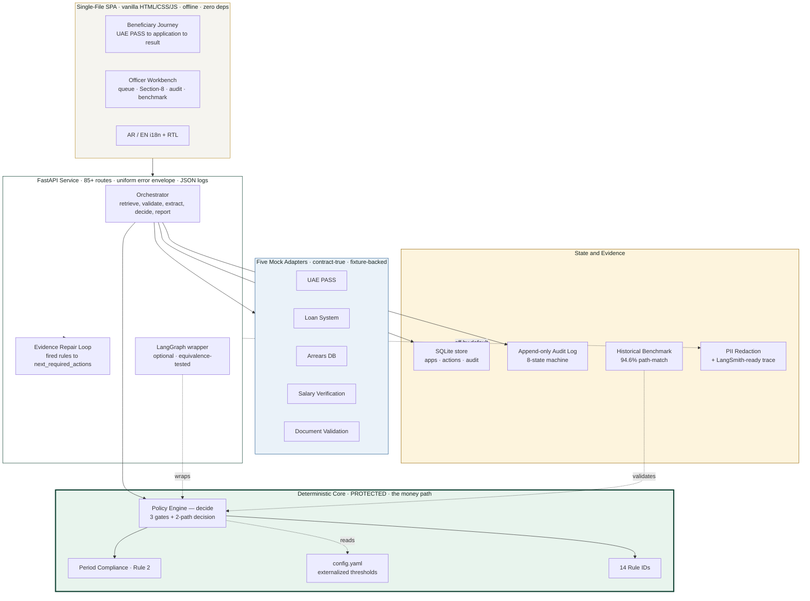
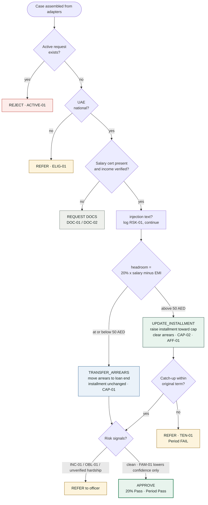
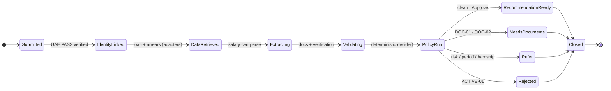

<!-- ════════════════════════════════════════════════════════════════════════ -->
<!--                              A G E N T   S A N A D                         -->
<!-- ════════════════════════════════════════════════════════════════════════ -->

<div align="center">

```
 █████╗  ██████╗ ███████╗███╗   ██╗████████╗   ███████╗ █████╗ ███╗   ██╗ █████╗ ██████╗
██╔══██╗██╔════╝ ██╔════╝████╗  ██║╚══██╔══╝   ██╔════╝██╔══██╗████╗  ██║██╔══██╗██╔══██╗
███████║██║  ███╗█████╗  ██╔██╗ ██║   ██║      ███████╗███████║██╔██╗ ██║███████║██║  ██║
██╔══██║██║   ██║██╔══╝  ██║╚██╗██║   ██║      ╚════██║██╔══██║██║╚██╗██║██╔══██║██║  ██║
██║  ██║╚██████╔╝███████╗██║ ╚████║   ██║      ███████║██║  ██║██║ ╚████║██║  ██║██████╔╝
╚═╝  ╚═╝ ╚═════╝ ╚══════╝╚═╝  ╚═══╝   ╚═╝      ╚══════╝╚═╝  ╚═╝╚═╝  ╚═══╝╚═╝  ╚═╝╚═════╝
```

### A governed, agentic casework system for housing-loan arrears rescheduling

**Sheikh Zayed Housing Programme** · UAE Ministry of Energy &amp; Infrastructure
*Agentera Hackathon · MOEI × 42 Abu Dhabi*

<br/>

[](#-quality--testing)
[](https://www.python.org/)
[](https://fastapi.tiangolo.com/)
[](https://docs.pydantic.dev/)
[](#-tooling-langgraph--observability)
[](#-quick-start)
[](#-benchmark--proof-against-reality)
[](#-production-boundary)

<br/>

> **`LLM reads and explains.`**&nbsp;&nbsp;**`Deterministic code decides.`**&nbsp;&nbsp;**`A human officer owns exceptions.`**

*Turns a five-working-day manual review into a sub-second, evidence-linked, fully-audited decision draft — without ever letting a language model touch the money.*

</div>

---

## Table of Contents

- [Why Agent Sanad](#-why-agent-sanad)
- [The Governing Doctrine](#-the-governing-doctrine-our-usp)
- [System Architecture](#-system-architecture)
- [The Decision Engine](#-the-decision-engine-the-moat)
- [Request Lifecycle &amp; State Machine](#-request-lifecycle--state-machine)
- [Quick Start](#-quick-start)
- [The Two Surfaces](#-the-two-surfaces)
- [API Surface](#-api-surface-17-routes)
- [13 Demo Cases](#-13-demo-cases)
- [Tooling: LangGraph &amp; Observability](#-tooling-langgraph--observability)
- [Benchmark: Proof Against Reality](#-benchmark--proof-against-reality)
- [Quality &amp; Testing](#-quality--testing)
- [Security &amp; Governance](#-security--governance)
- [Project Structure](#-project-structure)
- [Engineering Principles (IBM 7 Skills)](#-engineering-principles-ibm-research-7-skills)
- [Production Boundary](#-production-boundary)
- [Documentation Index](#-documentation-index)

---

## ⚡ Why Agent Sanad

The Sheikh Zayed Housing Programme grants housing loans to UAE nationals. When a
beneficiary falls behind, unpaid installments accumulate as **arrears**, and the
beneficiary applies to **reschedule**. Today an officer studies each case by
hand — income, family situation, arrears, remaining term, repayment capacity —
and the process takes **around five working days** per application.

The mandate is to compress that to **instant or near-instant** service *while
preserving fairness, transparency, governance, and consistency.*

<table>
<tr>
<td align="center" width="33%"><h3>~5 working days</h3>manual officer review</td>
<td align="center" width="33%"><h3>&lt; 1 second</h3>Agent Sanad decision draft <sup>(measured)</sup></td>
<td align="center" width="33%"><h3>100% audited</h3>every decision is traceable</td>
</tr>
</table>

This is **not a chatbot** and **not an "AI judge."** It is a narrow,
ministry-grade casework agent that does the officer's whole job — retrieve,
validate, analyze, reason, recommend, explain — and routes only genuine
exceptions to a human.

---

## 🛡 The Governing Doctrine (our USP)

Every serious team will claim "technical depth." Our differentiator is an
**architecture that makes the depth provable.** Responsibility is split along a
hard boundary that is enforced in code and asserted by tests:

```mermaid
flowchart LR
    subgraph LLM["LLM · READ-ONLY"]
        direction TB
        L1["Extract fields from documents"]
        L2["Write plain-language reasoning"]
        L3["Translate and explain"]
    end
    subgraph DET["DETERMINISTIC CODE · DECIDES"]
        direction TB
        D1["Apply the 20% deduction cap"]
        D2["Choose UPDATE vs TRANSFER path"]
        D3["Enforce period and active-request rules"]
        D4["Fire rule IDs and score confidence"]
    end
    subgraph HUMAN["HUMAN OFFICER · OWNS EXCEPTIONS"]
        direction TB
        H1["Approve · Adjust · Escalate"]
        H2["Reason-coded overrides"]
    end

    LLM -- "typed, validated facts" --> DET
    DET -- "exceptions and low confidence" --> HUMAN

    style LLM fill:#eaf2f9,stroke:#235a8f,color:#172420
    style DET fill:#e8f4ed,stroke:#0b3d2e,color:#172420,stroke-width:3px
    style HUMAN fill:#fdf4dd,stroke:#946300,color:#172420
```



| Layer | **May** | **Must never** |
|---|---|---|
| **LLM** | read text, extract typed fields, write the reasoning paragraph, translate | compute an installment, choose a path, approve/reject, write state |
| **Deterministic engine** | validate completeness, compute headroom &amp; the plan, choose the path, fire rule IDs, enforce Rules 1–3 | invent a fact not in a validated schema, call the LLM for a number |
| **Human officer** | approve / adjust / escalate with a reason code | bypass the append-only audit log |

> **Why this wins in front of a Finance department:** the language model
> *physically cannot* move money. Path selection, the 20% cap, headroom, and
> period compliance live in deterministic Python that is unit-tested and
> benchmarked against three years of real ministry decisions.

---

## 🏗 System Architecture

A single FastAPI service exposes a small typed API, serves a zero-dependency
single-file UI, drives five contract-shaped mock adapters, and routes every
financially-sensitive decision through one deterministic engine.



**Stack:** Python 3.11 · FastAPI · Pydantic v2 (`extra="forbid"` on every
payload) · SQLite (stdlib, zero deps) · vanilla single-file frontend ·
LangGraph (optional, import-guarded). **No external network call is required on
the demo path.**

---

## 🧠 The Decision Engine (the moat)

`decide()` is a pure, deterministic function. It was reverse-engineered from
~2,000 real historical decisions and is the single source of every financial
outcome. Three governance gates run first; then a two-path affordability
decision; then risk and period checks.



**The core formula** — the 20% rule is a *target*, not just a gate (this matches
how officers actually behave in the data: deductions cluster right at the cap):

```text
cap       = 0.20 × verified_monthly_income           # Rule 1 — official
headroom  = cap − current_installment                # capacity to increase

headroom  > 0   →  UPDATE_INSTALLMENT                 # raise EMI, clear arrears faster
                   premium  = floor(headroom)
                   months   = ceil(arrears / premium)
                   new_EMI  = current_EMI + premium   # deduction ≈ 20%

headroom ≤ 0   →  TRANSFER_ARREARS                   # no room: move arrears to loan end
```

**The three official governance rules**, enforced in deterministic code:

| # | Rule | Enforcement |
|---|---|---|
| **1** | Monthly deduction must **not exceed 20%** of income | `cap = 0.20 × salary`, hard-checked, surfaced as a Pass/Fail chip |
| **2** | New schedule must **not exceed the original approved term** | `period.py` per-path check → `TEN-01` → refer |
| **3** | An existing active request **may auto-reject** | Gate 1, `ACTIVE-01`, before any computation |

All thresholds live in [`backend/policy/config.yaml`](backend/policy/config.yaml)
— nothing financial is hard-coded — so a ministry validation answer is a
one-line config change, not a rewrite.

---

## 🔄 Request Lifecycle &amp; State Machine

Every case traverses a hard 8-state machine. Each transition emits an
append-only `AuditEvent` carrying the actor, reason, and `mock_mode` flag. The
officer drawer reconstructs the timeline from these *real* events — it is not a
hard-coded picture.



When a case ends in `NeedsDocuments`, `Refer`, or `Rejected`, the **Evidence
Repair Loop** ([`backend/actions.py`](backend/actions.py)) maps the fired rules
to a structured list of `next_required_actions` — turning dead-end states into
guided "upload this / confirm that / contact the Programme" instructions for the
beneficiary, and task status for the officer.

---

## 🚀 Quick Start

### Windows (PowerShell)

```powershell
python -m venv .venv
.venv\Scripts\activate
pip install -r requirements.txt
.\run.ps1
```

### macOS · Linux · Git Bash

```bash
python -m venv .venv
source .venv/bin/activate
pip install -r requirements.txt
./run.sh
```

Then open **<http://127.0.0.1:8000/>** — you land on the branded service page.

The launchers set demo-safe defaults and **refuse to start if port 8000 is
already bound**, so an old server process can never silently serve stale routes:

```text
PYTHONPATH=.   LOCAL_MOCK_MODE=true   SANAD_LIVE_EXTRACTION=1   LANGSMITH_TRACING=false
```

A boot-time **build handshake** (`APP_VERSION` ↔ `CLIENT_BUILD`) shows an
actionable banner if the running server is older than the page it is serving.

---

## 🖥 The Two Surfaces

<table>
<tr>
<td width="50%" valign="top">

### 👤 Beneficiary Journey
*Citizen-facing · status only, never internal math*

1. **Landing** — branded service entry, offline-mode clearly marked
2. **UAE PASS** — simulated identity verification (no credentials)
3. **Application stepper** — Programme data (auto-retrieved) → financial
   details (editable) → documents → review
4. **Processing** — live agent timeline animated from real audit transitions
5. **Result** — a plain-language outcome + next steps

Submit a **sample case** *or* a fully **custom application** — both flow through
the same Pydantic schemas and the same deterministic engine. The app is
provably not hard-coded.

</td>
<td width="50%" valign="top">

### 🧑‍💼 Officer Workbench
*Casework-facing · full evidence &amp; governance*

- **Case queue** with **Exception Studio** filters (policy stop · evidence
  problem · affordability risk · social hardship · security risk)
- **Section-8 recommendation** — all 12 official fields
- **Six-section evidence trace** — state timeline · adapter map · rule trace ·
  calculation trace · period trace · security trace
- **Append-only audit feed** + **benchmark / impact panel**
- **Officer actions** — approve / adjust / escalate (reason-coded, persisted)
- **LangGraph toggle** + orchestrator chip proving plain ≡ graph

</td>
</tr>
</table>

---

## 🔌 API Surface (85+ routes)

Every payload is a Pydantic v2 model. Every error returns the same envelope.

```jsonc
// Uniform error contract (PRD §5.5) — no framework tracebacks ever leak
{ "error_code": "VALIDATION_ERROR", "message": "...", "path": "/...", "app_version": "1.1.0" }
```

| Method | Route | Purpose |
|:---|:---|:---|
| `GET`  | `/healthz` | Liveness · `mock_mode` · `app_version` · orchestrator state |
| `GET`  | `/` | Single-page application (served by FastAPI) |
| `GET`  | `/architecture` | Machine-readable IBM 7-skills mapping (the USP, as JSON) |
| `GET`  | `/cases` | List the 13 seeded cases + picker metadata |
| `GET`  | `/benchmark` | Benchmark metrics + the honest claim string |
| `GET`  | `/cases/{id}` | Assembled `Case` snapshot (no policy run) |
| `GET`  | `/cases/{id}/audit` | Full audit trail for a case |
| `POST` | `/demo/run/{id}` | **Main path** — retrieve → decide → Section-8 report |
| `POST` | `/demo/run-graph/{id}` | LangGraph orchestrator (auto-falls-back to plain) |
| `GET`  | `/demo/compare/{id}` | **Live proof** that plain ≡ graph for a case |
| `POST` | `/cases/{id}/decide` | Same envelope as `/demo/run` (v1.1 route name) |
| `POST` | `/cases/{id}/officer-action` | Human action: approve / adjust / escalate |
| `POST` | `/applications/mock` | Validate + assemble a custom application (no decide) |
| `POST` | `/applications/mock/decide` | Full custom application → decision |
| `GET`  | `/applications` | List persisted custom applications |
| `GET`  | `/applications/{id}` | Retrieve a persisted application + report + audit |
| `GET`  | `/officer-actions` | List persisted officer actions |

---

## 🎯 13 Demo Cases

Each fixture was **hand-traced through `decide()` before its test was written** —
the expected output is derived, never guessed. Together they exercise every
branch of the policy matrix and every governance gate.

| Case | Recommendation | Path | Key Rules | Demonstrates |
|:---|:---|:---|:---|:---|
| `GOLDEN` | ✅ Approve | UPDATE | CAP-02, AFF-01 | clean affordable update |
| `NOHEAD` | ⚠️ Refer | TRANSFER | HARD-01, CAP-01 | no headroom under cap |
| `MISSING` | 📄 Request docs | — | DOC-01 | no false certainty |
| `ACTIVE` | ❌ Reject | — | ACTIVE-01 | Rule 3 gate, pre-computation |
| `CONTRA` | ⚠️ Refer | TRANSFER | INC-01, RSK-01 | contradiction + injection |
| `HIGH_OBLIGATIONS` | ⚠️ Refer | UPDATE | OBL-01 | obligations &gt; 60% of income |
| `PERIOD_BREACH` | ⚠️ Refer | UPDATE | TEN-01 | Rule 2 period breach |
| `HARDSHIP` | ✅ Approve | TRANSFER | HARD-02 | verified temporary hardship |
| `ZERO_OR_MISSING_INCOME` | 📄 Request docs | — | DOC-02 | unverifiable income |
| `LOW_INCOME_PER_MEMBER` | ✅ Approve | UPDATE | FAM-01 | family-size sensitivity |
| `UNVERIFIED_HARDSHIP` | ⚠️ Refer | TRANSFER | HARD-01 | unverified claim → human |
| `PROMPT_INJECTION_ONLY` | ✅ Approve | UPDATE | RSK-01 | **injection logged, policy unchanged** |
| `HIGH_CAPACITY_UPDATE` | ✅ Approve | UPDATE | CAP-02, AFF-01 | engine uses real headroom |

---

## 🧩 Tooling: LangGraph &amp; Observability

The optional tooling layer was implemented under one rule: **frameworks may
orchestrate, trace, and observe — they must never decide the money.**

### LangGraph orchestration *(optional, equivalence-proven)*

A 10-node `StateGraph` wraps the same workflow as the plain orchestrator. The
critical node, `run_policy_engine`, calls the **existing `decide()`** — policy is
never reimplemented. Pre-policy nodes are inspect-only labels, so the gates still
fire inside the engine.

```text
verify_identity → retrieve_programme_data → check_active_request → validate_documents
   → extract_income → verify_salary → run_policy_engine → build_reasoning
   → emit_audit → route_exception_or_close
```

- **Equivalence is test-enforced for all 13 cases** — same recommendation, path,
  fired rules, and compliance chips. Prove it live: `GET /demo/compare/{id}` → `equivalent: true`.
- The graph route **auto-falls-back to the plain orchestrator** on any failure
  (`impact.fallback_used: true`). The demo can never break because of it.
- Default orchestrator stays `plain` (`SANAD_ORCHESTRATOR=plain`); the
  beneficiary flow never touches the graph route.

### Observability *(LangSmith-ready, off by default, PII-safe)*

- `LANGSMITH_TRACING=false` by default — the app is fully functional without it.
- **Redaction is unconditional**: every payload passes an allow-list + scrubbing
  of Emirates-ID patterns, Arabic narratives, document text, and identifier-bearing
  keys. Setting `TRACE_REDACTION=false` while tracing is on makes the adapter
  **refuse to emit** rather than risk leaking data.
- No hard `langsmith` dependency — with the package absent, tracing degrades to
  redacted structured-log lines.

> **Deliberately not added:** LlamaIndex, LangChain, CrewAI, AutoGen, Semantic
> Kernel, DSPy, OpenAI Agents SDK. MCP remains a documented production-roadmap
> item. Full rationale: [`docs/TOOLING_IMPLEMENTATION_SUMMARY.md`](docs/TOOLING_IMPLEMENTATION_SUMMARY.md).

---

## 📊 Benchmark — Proof Against Reality

The single asset most teams will not have: the deterministic engine is
**replayed against ~2,000 real historical decisions (2023–2025)**, calibrated on
2023–2024 and validated on the **held-out 2025** set.

<table>
<tr>
<td align="center"><h3>94.6%</h3>path-match accuracy<br/><sub>held-out 2025 · n = 522</sub></td>
<td align="center"><h3>100%</h3>UPDATE plans within<br/>the 20% cap <sub>(by construction)</sub></td>
<td align="center"><h3>AED 557</h3>median premium deviation<br/><sub>(not claimed as exact)</sub></td>
<td align="center"><h3>100%</h3>deterministic on rerun</td>
</tr>
</table>

> **The honest claim — verbatim, and we never overstate it:**
> *Agent Sanad matches the officers' rescheduling **path** 94.6% of the time on
> held-out 2025 cases, and every UPDATE plan it sets is within the 20% cap. It
> does **not** claim exact reproduction of every premium or duration.*

Where the engine and the officer differ on the exact premium, it is because
officers apply discretion the data does not fully encode — and that discretion is
**deliberately routed to a human**. The runner is included; the real workbook is
gitignored and never committed:

```powershell
python benchmark/run.py benchmark/data/RescheduleArrears.xlsx
```

---

## ✅ Quality &amp; Testing

**231 tests across 21 files** (v1.5.0 target: 220+), all passing. Run them:

```powershell
$env:PYTHONPATH="."
python -B -m pytest tests\ -q -p no:cacheprovider      # → 231 passed
```

| Test file | Focus |
|:---|:---|
| `test_policy.py` | 13 case assertions + endpoint contracts (hand-traced expectations) |
| `test_demo_api.py` | API contract + build-version handshake |
| `test_applications.py` | Custom application flow (proves not hard-coded) |
| `test_graph_equivalence.py` | Plain ≡ LangGraph for all 13 cases + fallback |
| `test_observability.py` | Tracing off by default · redaction safety · refuse-to-emit |
| `test_governance.py` | No workbook tracked · no PII · risky cases route to human |
| `test_security.py` | XSS escaping · error envelope · PII absence |
| `test_store.py` | SQLite persistence + graceful degradation |
| `test_benchmark_replay.py` | Benchmark replay logic across 7 scenarios |
| `test_connectors.py` | 6 mock connectors: health, simulate, reset, failure modes |
| `test_connector_contracts.py` | Pydantic model contracts for all connector types |
| `test_consent.py` | Consent ledger: create, get, revoke, events |
| `test_consent_guard.py` | v1.5 consent guard v2: purpose, scope, expiry, revocation |
| `test_v1_4_integration.py` | RBAC, simulator, decision package, audit chain, supervisor |
| `test_abac.py` | v1.5 attribute-based access control enforcement |
| `test_sessions.py` | v1.5 UAE PASS session v3: nonce, expiry, replay protection |
| `test_signature_integrity.py` | v1.5 hash binding + tamper detection for signatures |
| `test_action_workflow.py` | v1.5 action workflow: upload-mock, reject, resubmit, waive |
| `test_appeals.py` | v1.5 appeals workbench: create, evidence, review, decision |
| `test_supervisor_command.py` | v1.5 supervisor: backlog, SLA, fairness, incidents, overrides |
| `test_accessibility_i18n.py` | v1.5 accessibility + Arabic i18n validation |

> **Protected files** — the deterministic core — are never modified without a
> full suite re-run and manual review:
> `policy/engine.py` · `policy/period.py` · `policy/config.yaml` ·
> `policy/rules.py` · `benchmark/replay.py` · `benchmark/score.py`.

---

## 🔐 Security &amp; Governance

| Control | Implementation |
|:---|:---|
| **Untrusted documents** | Document text fires `RSK-01` but can never change policy logic — asserted by `PROMPT_INJECTION_ONLY` (plan stays byte-identical) |
| **Read-only LLM** | Cannot decide, write state, or call the engine — by construction |
| **PII discipline** | Synthetic identifiers only (`APP-*`, `AGR-*`, masked names); real workbook gitignored &amp; verified untracked |
| **Trace redaction** | Emirates-ID / Arabic / document-text scrubbing before any emission; refuse-to-emit interlock |
| **XSS-safe UI** | All dynamic strings escaped before rendering |
| **Append-only audit** | Every adapter call, rule firing, transition, and officer action recorded |
| **Confidence band** | High / medium / low; only high-confidence, in-cap, no-risk cases are auto-approvable |
| **Uniform error contract** | `{error_code, message, path, app_version}` — no stack traces to clients |

---

## 📁 Project Structure

```text
agent-sanad/
├── backend/
│   ├── app.py                 # FastAPI app — 85+ routes, error envelope, structured logs
│   ├── schemas.py             # Pydantic v2 contracts (extra="forbid" everywhere)
│   ├── applications.py        # Custom application form → synthetic Case
│   ├── actions.py             # Evidence Repair Loop (fired rules → next actions)
│   ├── store.py               # SQLite persistence (stdlib, graceful degradation)
│   ├── audit.py               # Append-only audit log + 8-state machine
│   ├── confidence.py          # Confidence band + risk scoring
│   ├── extraction.py          # Salary-cert parsing with cached fallback
│   ├── reasoning.py           # Deterministic cached reasoning (optional LLM hook)
│   ├── adapters/              # 5 contract-true mock adapters + 13 fixtures
│   ├── policy/                # 🔒 PROTECTED deterministic core
│   │   ├── engine.py          #    decide() — the money path
│   │   ├── period.py          #    Rule 2 period compliance
│   │   ├── rules.py           #    14 rule IDs
│   │   └── config.yaml        #    externalized thresholds
│   ├── graph/                 # Optional LangGraph wrapper (import-guarded)
│   └── observability/         # PII redaction + LangSmith-ready adapter
├── frontend/
│   ├── index.html             # Single-file hash-routed SPA (zero deps)
│   └── i18n.json              # AR/EN translation strings (RTL support)
├── benchmark/                 # 🔒 Historical replay, normalize, score (94.6%)
├── tests/                     # 21 files · 231 tests
├── docs/                      # Architecture, readiness, tooling, demo, Q&A
├── seeds/cases_v1.json        # Human-facing demo case index
├── run.ps1 · run.sh           # One-command launchers (stale-port guard)
└── requirements.txt
```

---

## 🎓 Engineering Principles (IBM Research 7 Skills)

Agent Sanad is built to the
[IBM Research agent-engineering playbook](7%20skills%20to%20build%20AI%20Agents%20by%20IBM%20Research.md)
— the seven disciplines that separate a production agent from a prompt
experiment. The mapping is live and machine-readable at `GET /architecture`.

| # | Skill | Where it ships in Agent Sanad |
|:--:|:---|:---|
| 1 | **System design** | FastAPI orchestrator + the hard LLM/deterministic/human boundary |
| 2 | **Tool &amp; contract design** | Pydantic v2 `extra="forbid"` on every payload; 5 typed adapter contracts |
| 3 | **Retrieval engineering** | 5 fixture-backed adapters; salary extraction with cached fallback |
| 4 | **Reliability engineering** | Offline-first default; cached fallbacks; stale-port guard; auto graph-fallback |
| 5 | **Security &amp; safety** | Untrusted docs (RSK-01); read-only LLM; trace redaction; XSS-escaped UI |
| 6 | **Evaluation &amp; observability** | 94.6% historical benchmark; append-only audit; 231 tests; structured logs |
| 7 | **Product thinking** | Beneficiary vs officer surfaces; Evidence Repair Loop; AR/EN i18n |

---

## 🏁 Production Boundary

We are precise about what this is. Agent Sanad is a **production-shaped
prototype with pilot-ready architecture** — *not* a deployed government system.

**Production-shaped today:** the decision engine, typed data contracts, test
coverage, error contracts, append-only audit trail, governance posture, PII
discipline, and the offline-first reliability model.

**Mocked by design** (contract-true adapters — swap the body, the workflow core
never changes): UAE PASS, loan system, arrears database, salary verification,
document validation.

**Genuine pilot work that remains** (documented in
[`docs/PRODUCTION_READINESS.md`](docs/PRODUCTION_READINESS.md), not hidden): real
UAE PASS OAuth, authenticated MOEI integrations, production database &amp; secrets
management, deployment &amp; monitoring, a formal security/compliance review, an
accessibility audit, and a production OCR pipeline.

> None of the pilot work touches the decision engine, the rule catalog, the
> schemas, or the audit model — which is precisely the point of the architecture.

---

## 📚 Documentation Index

| Document | Contents |
|:---|:---|
| [`docs/ARCHITECTURE.md`](docs/ARCHITECTURE.md) | System design deep-dive + IBM 7-skills mapping |
| [`docs/PRODUCTION_READINESS.md`](docs/PRODUCTION_READINESS.md) | Honest pilot-gap assessment, committee-grade |
| [`docs/TOOLING_IMPLEMENTATION_SUMMARY.md`](docs/TOOLING_IMPLEMENTATION_SUMMARY.md) | LangGraph + observability, and what was deliberately skipped |
| [`docs/FINAL_HARDENING_REPORT.md`](docs/FINAL_HARDENING_REPORT.md) | Seven-pass review ledger + defect fixes |
| [`docs/V1_1_COMPLETION_SUMMARY.md`](docs/V1_1_COMPLETION_SUMMARY.md) | Full v1.1 delivery record |
| [`docs/DEMO_SCRIPTS.md`](docs/DEMO_SCRIPTS.md) | 3-minute live + 90-second backup demo scripts |
| [`docs/JUDGE_QA.md`](docs/JUDGE_QA.md) | Anticipated judge questions, pre-answered |
| [`AGENTS.md`](AGENTS.md) | Contributor / coding-agent operating guide |

---

<div align="center">

**Agent Sanad** &nbsp;·&nbsp; Sheikh Zayed Housing Programme &nbsp;·&nbsp; UAE MOEI
<br/>
<sub>Built to a governed agent-engineering doctrine: the LLM reads, deterministic code decides, the human owns exceptions.</sub>

</div>
